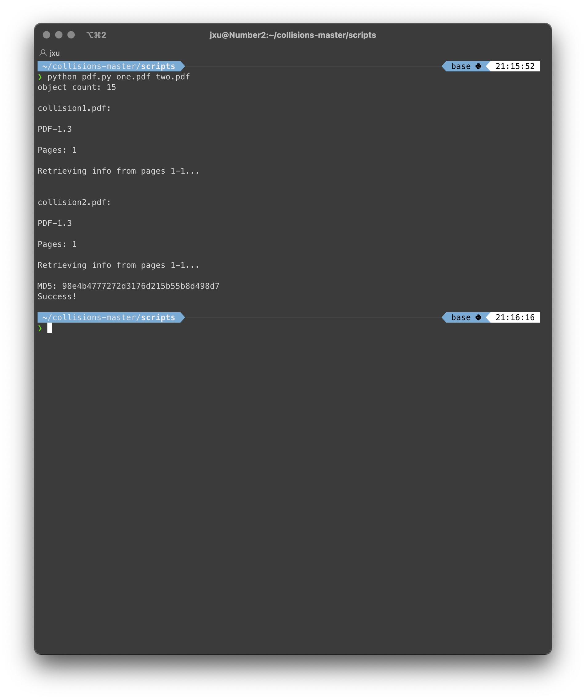
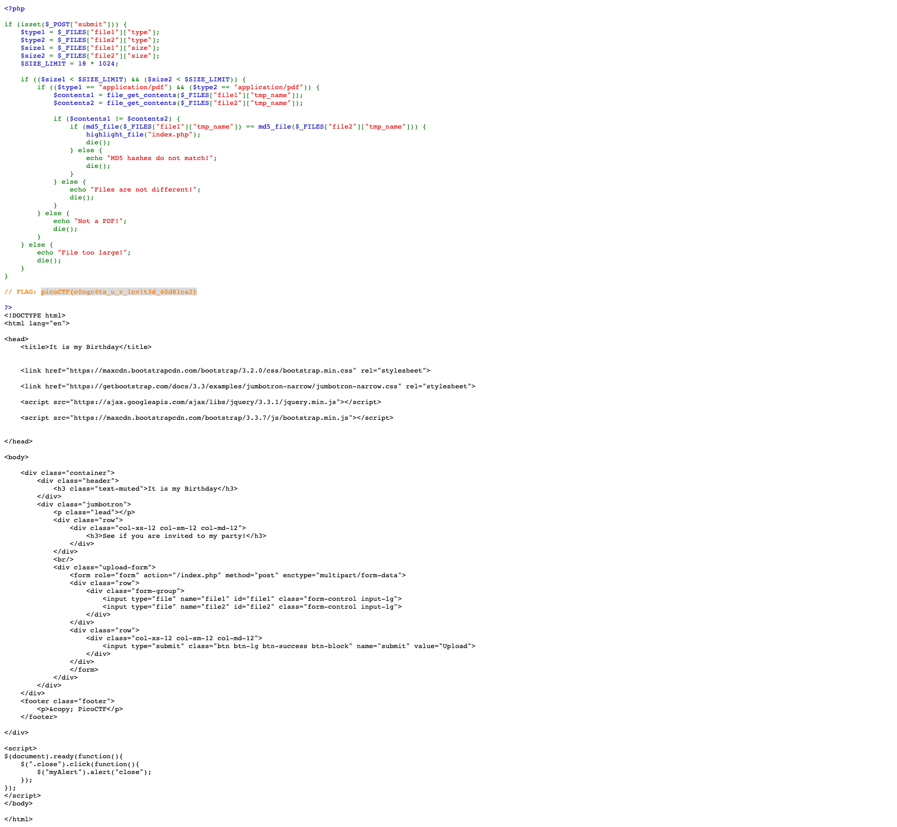

# It's my birthday

## Introduction

## Summary

* MD5 message-digest algorithm is a hash function that produces a 128-bit hash value. 
* MD5 has been found to suffer from extensive vulnerabilities. It is unsuitable for cryptographic purposes. It is easy to find two different messages that hash to the same value. 
* MD5 can be used as a checksum to verify data integrity, but only against unintentional corruption. It is also suitable to be used outside of cryptographic purposes like determining the partition for a particular key in a partitioned database.
* As of 2019, MD5 continues to be widely used, despite its well-documented weaknesses and deprecation by security experts. 

## Tools

* [PDF MD5 Collider](https://github.com/corkami/collisions/blob/master/scripts/pdf.py)

## The process

### Step 1. Accessing the target

When I open the target URL, I see a website form with two fields. Both are file input fields. 


According to the briefing, this page will take two input files and check if those two files have different content but have the same MD5 checksum.

### Step 2. Probing the form

I found two PDFs, put those two files in the form, and clicked upload. It moves to a new page with a "File too large!" message. The web application seems to be pretty strict with file size. I then make two identical files with single-line text and convert them into PDFs. The form gives out a "Files are not different!" message when I upload those. Okay, so I upload two small pdfs that are different, and the website gives out "MD5 hashes do not match." So now, all I need to do is upload two different files with the same MD5 hash.

### Step 3. Creating files

I am using the [PDF MD5 collider](https://github.com/corkami/collisions/blob/master/scripts/pdf.py) script that I found on Github. For this script to work, you need to have [MuPdf](https://mupdf.com/) installed on your computer. On a Mac, you can install this using homebrew.

```bash
$ brew install mupdf
```
For the script to work, I made some minor adjustments. The first adjustment I made was to change the `mutool` location. I also updated the code because Python complained about several data type mismatches. The updated script can be found [here](https://gist.github.com/joashxu/57fbc8c63e3f61dc94390f91329d18b7).

I then ran the script with the two PDF files I made in the previous step as arguments.



The script generated two files: `collision1.pdf` and `collision2.pdf`. The content of these two files is different, but they both have the same MD5 checksum. 

### Step 4. Result

I then submitted those two files via the form, and it returned a page with the PHP source code and the flag.



## Source

[picoCTF challenge #109](https://play.picoctf.org/practice/challenge/109)

## Tags
#web-exploitation
