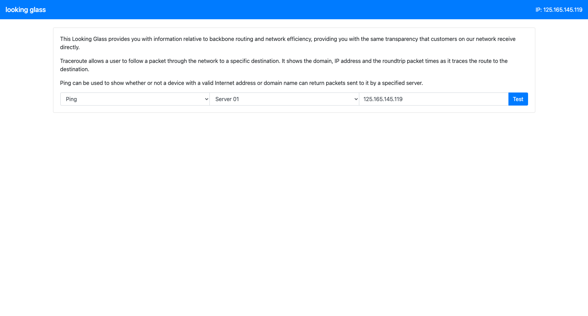
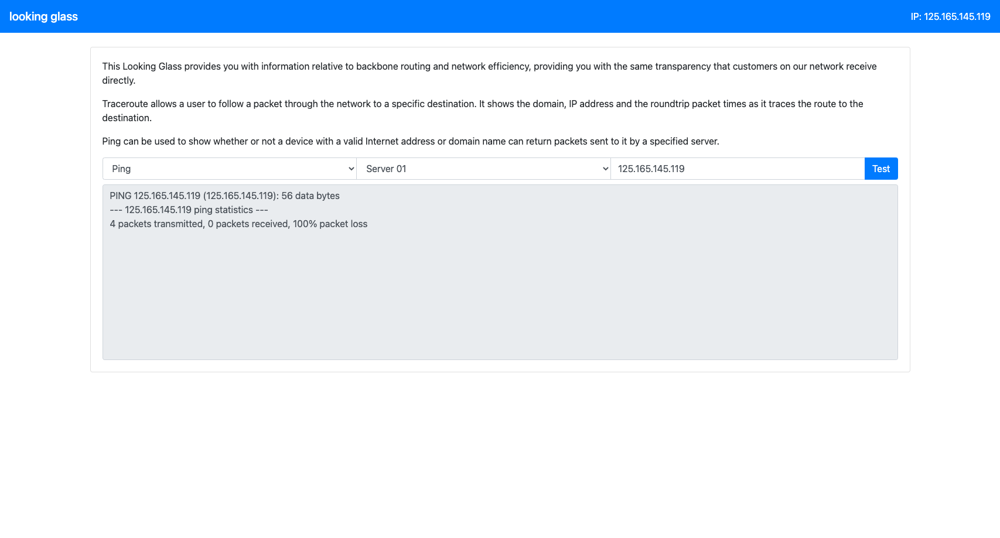
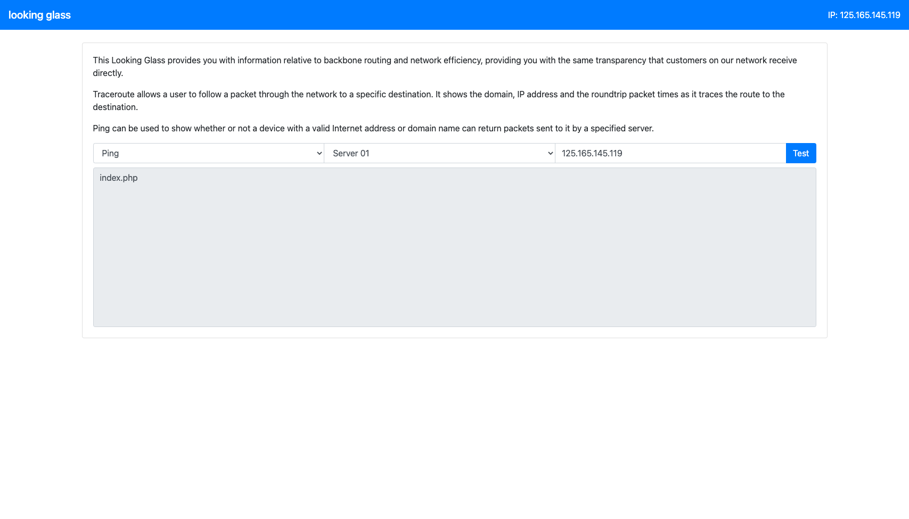
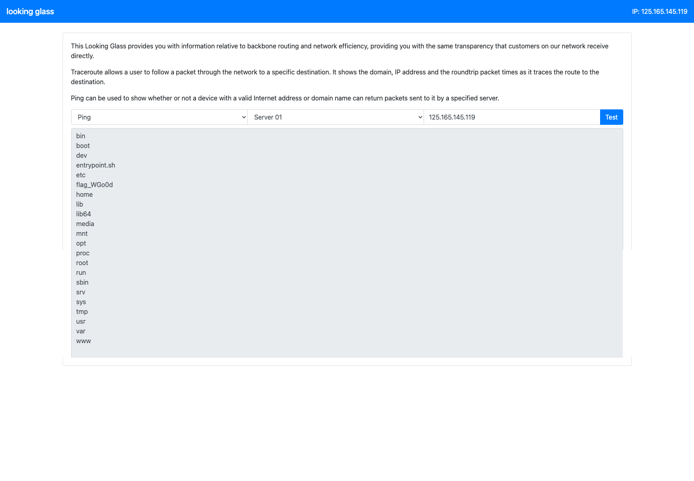

# Looking glass

## Summary

* When you take input from users, you should sanitize the input.
* Never assume user will use the system as you intended them to be used.
* If you do not sanitized user input and pass those input to execute a system command, you are vunerable to Remote Code Execution (RCE).

## Process

### Step 1. The target

Opening the target using a browser I can see the following:

When I clicked submit, the website will return a page with the `ping` command result.

### Step 2. Finding the vulnerabilities

From step 1, it looks like the website will pass the IP to the shell command, execute and display the result. It does not seems to clean the input. To verify this, I update the IP address field to '125.165.145.119 | ls'.

And the result shows the content of the directory. I then try to get the parent directory of the current directory. I updated the IP address field to '127.0.0.1 | ls ..'.

### Step 3. Result

There is this strange file named "flag_WGo0d", so I decided to open it by updating the IP address field to '127.0.0.1 | cat ../flag_WGo0d'.
The file shows the flag.

## Source 
HackTheBox. OWASP top 10. Looking glass.

## Tags
#web-exploitation #rce
